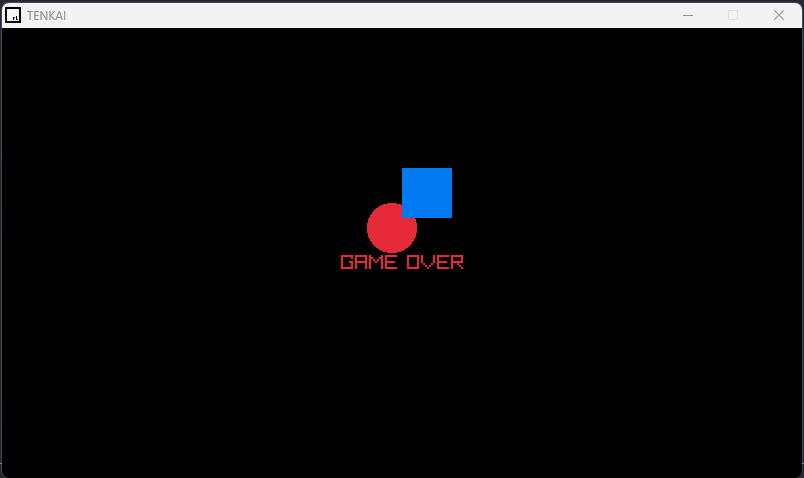

# Raylib Circle Square Collision Game

This is a practice project to understand the basics of Raylib, rendering, user input and how to make a absolutely simple game in C.

## How to play

You can move the circle using the keyboard arrows. If you are hit by the square, then is game over.

